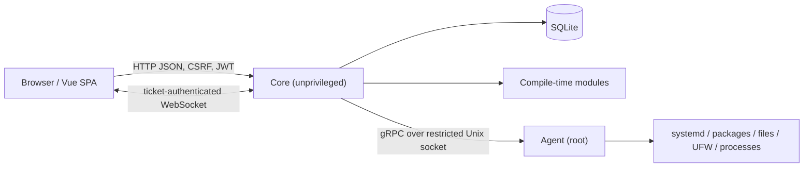
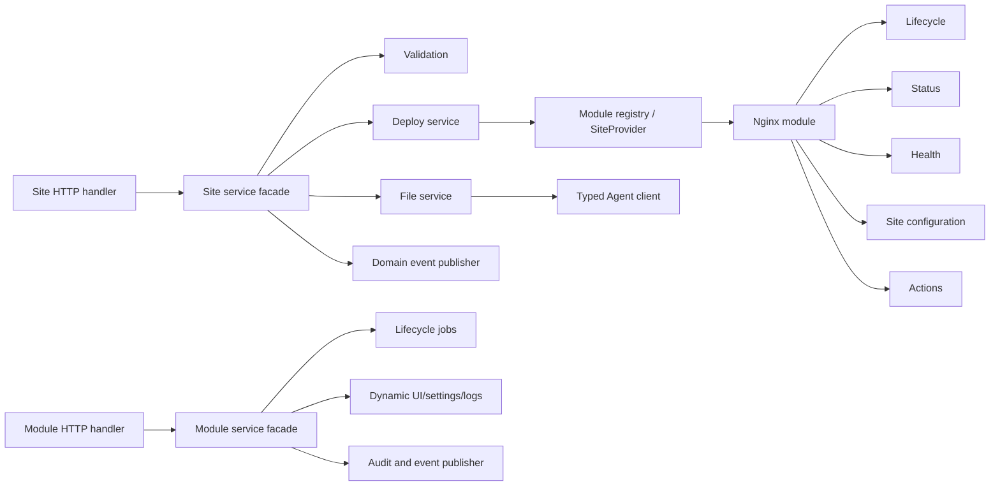
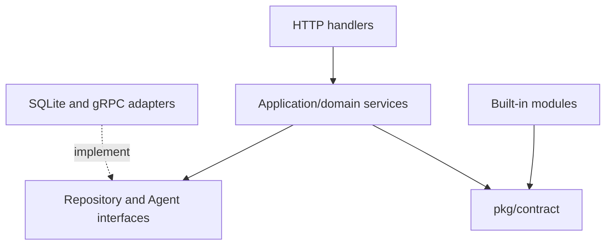
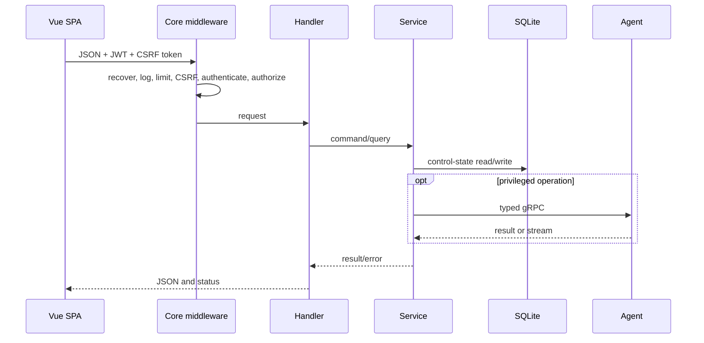
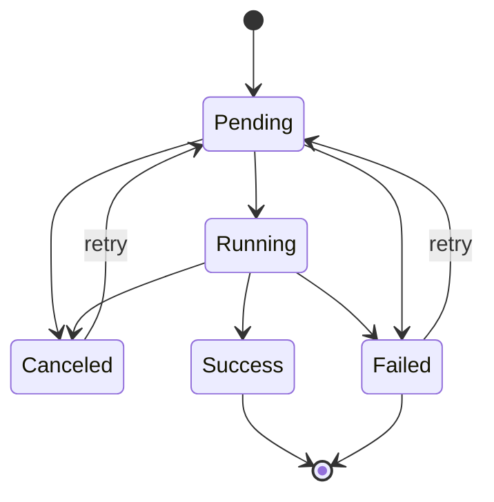
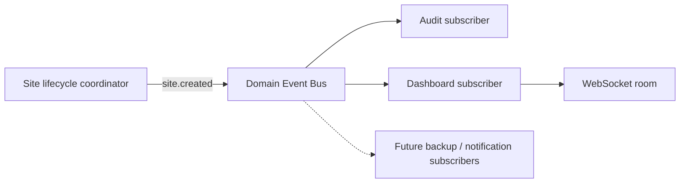
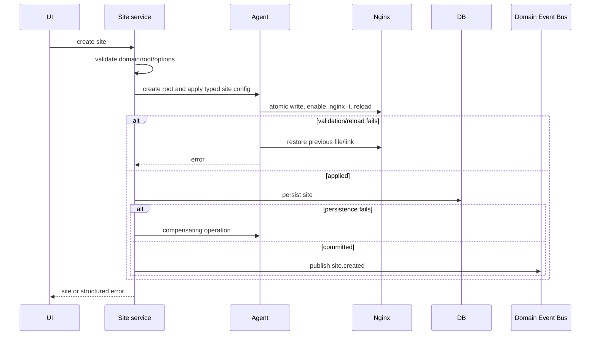

# OpenDeploy architecture

This document describes revision `1b96285` as audited on 2026-07-27. Implemented
behavior is documented here; plans and known deviations are in
[ROADMAP.md](ROADMAP.md) and [AUDIT.md](AUDIT.md).

## System overview

OpenDeploy is a single-host Linux administration platform:

- **Core** (`opendeploy-core`) is an unprivileged HTTP application containing
  domain services, SQLite repositories, authentication, the module registry and
  the embedded Vue SPA.
- **Agent** (`opendeploy-agent`) is a root gRPC service for operating-system
  mutations and telemetry.
- **CLI** (`opendeploy`) is a small local utility currently focused on version
  and update-request behavior, not a complete administration client.
- **Web SPA** is a Vue 3/Vite/Pinia application served by Core.



Core and Agent run on the same machine. Remote Agents and mTLS are planned, not
implemented.

## Trust boundaries

Browser input is untrusted. Core authenticates JWTs, applies CSRF and permission
middleware, validates request DTOs and emits structured JSON errors. Agent must
independently validate Core requests because compromise of Core must not become
unrestricted root access. Modules are compiled into Core and are trusted code;
they are neither downloaded nor sandboxed.

The boundary reduces blast radius but is not a complete security guarantee.
Generic command operands, filesystem symlinks, archive entries and module-route
permissions require the P0 hardening described in `AUDIT.md`.

## Directory structure

```text
cmd/                    Core, Agent and CLI entry points
configs/                example YAML configuration
deployments/            development install, update and uninstall scripts
internal/
  agent/                 privileged adapters and gRPC implementation
  agentclient/           Core-side gRPC client
  core/
    app/                 Fx composition root
    api/                 response and validation helpers
    auth/                JWT, refresh tokens, roles and repositories
    dashboard/           telemetry, processes and WebSocket tickets
    module/              registry, persistence and lifecycle jobs
    service/             managed systemd services and logs
    settings/            settings and updater integration
    site/                sites, files and Nginx orchestration
    updater/             GitHub status and update request
    webui/               SPA embed adapter
  platform/              config, DB, events, logging, tasks and sockets
modules/                 ten built-in compile-time modules
pkg/contract/            module and infrastructure interfaces
pkg/version/             build-injected version metadata
proto/agent/v1/          protobuf source and generated bindings
web/                     Vue SPA
.github/workflows/       Linux CI, smoke and release automation
```

## Layers and dependency injection

`cmd/core/main.go` starts the Fx graph in `internal/core/app/fx.go`.
Constructors provide configuration, logger, database, repositories, Agent
client, application services, handlers, module registry and HTTP server.

## Refactored service boundaries

The large site, module-manager and Nginx implementations are now split by
responsibility while their public constructors and HTTP contracts remain
unchanged.



`internal/core/site` keeps orchestration and CRUD compatibility in the facade;
path-sensitive file operations live in `FileService`, deployment translation
in `DeployService`, validation in `validation.go`, and lifecycle publication in
`events.go`/`subscribers.go`.

`internal/core/module` keeps lifecycle coordination in the facade, with job
management in `jobs.go`, dynamic data/settings/log operations in `dynamic.go`,
DTO projection in `view.go`, and audit/event concerns in `service_events.go`.

`modules/nginx` separates lifecycle, runtime status, health aggregation, site
configuration rendering and user actions into dedicated files. The module
struct remains the contract adapter and composition point.

The File Manager screen is a coordinator composed from `FileToolbar`,
`FileTable`, `FileContextMenu` and the lazily loaded `FileEditor`. Listing,
selection, sorting and navigation state live in `useFileListing`; editor
loading and persistence live in `useFileEditor`.



This is pragmatic layered/hexagonal architecture, not strict Clean Architecture.
There are no detected Go import cycles. Several large services combine
orchestration, validation and adapter concerns and should be split.

## Module system

Modules implement contracts in `pkg/contract/module.go` and are registered at
compile time. They can contribute metadata, lifecycle actions, settings, data
grids, logs and custom routes. Runtime Go plugins are not supported.

Lifecycle operations create process-local jobs, update module state, call the
module/Agent and publish events. Restart recovery, durable execution,
cancellation and retries are not implemented. Built-ins are Apache, Certbot,
Fail2ban, Firewall, Git, MySQL, Nginx, Node.js, PHP and PostgreSQL; capability
depth varies substantially.

## Agent, OS, package and service providers

Agent composes a command executor, systemd manager, APT/DNF package manager,
filesystem/archive managers, UFW manager, statistics collector and
transactional Nginx-site application. Ubuntu and RHEL provider foundations
exist, but the installer and integration evidence are Ubuntu-oriented.

The process runner restricts executable names, flags and resource operand
shapes, applies a clean environment, output limits and deadlines, and avoids
shell parsing. Generic destructive filesystem commands are forbidden. New
privileged product behavior must still prefer typed RPCs and resource-level
validation.

Service management stores selected systemd units in SQLite and exposes status,
start, stop, restart, remove and log operations. Package lifecycle streams Agent
output into module jobs.

## Configuration manager

Configuration loads from YAML and selected environment overrides such as
`OD_JWT_SECRET`. Installer-managed secrets are written to a protected
environment file. Managed configuration uses temporary-file validation and
replacement. Production requires a stable random JWT secret of at least 32
bytes; an ephemeral secret is development-only.

## File manager

Site endpoints resolve relative paths under a site's root and call Agent
filesystem RPCs. Agent performs lexical allowed-root checks and atomic writes.
Copy, move, permissions, ownership, directories, deletion and archives exist in
the gRPC contract. Roots are limited to managed configuration/site/state/log
locations; symlink ancestry and unsafe permissions/ownership are rejected.
Archive extraction preflights and writes entries in-process with traversal,
type, count and size limits. Directory-FD operations remain the final strict
TOCTOU hardening step.

## HTTP request lifecycle



Health, CSRF token, login and refresh are public. Dashboard WebSocket
authentication uses a short-lived one-time ticket. Generic module extension
routes are authenticated but currently need consistent granular RBAC.

## Task lifecycle



Module jobs keep status/output for polling and emit events. Work has a deadline,
supports cancellation, and startup marks persisted pending/running jobs as
explicitly interrupted instead of silently replaying them. Retry is enabled only
for operation types with a known replay strategy.

## Domain events

OpenDeploy uses an in-process Event Bus for reactions to completed domain facts.
Publishers depend on the `events.Bus` interface and do not know their consumers.
Events have a stable ID, optional correlation ID, UTC occurrence time, a
dot-separated type, and a typed payload.



The bus isolates subscriber panics, continues fan-out, and returns an aggregate
error. Domain services log delivery failures with the event ID. Subscriptions
are registered and removed through the Fx application lifecycle.

Eventual reactions are published only after the authoritative operation has
committed. Steps that define the atomic success of an operation remain
synchronous. For example, directory creation, web-server configuration
validation, database persistence, and rollback are still coordinated before
`site.created` is emitted. Audit and Dashboard refresh react independently
afterward. This prevents the Event Bus from weakening configuration consistency.

Current site events:

- `site.created`
- `site.updated`
- `site.deleted`
- `site.enabled`
- `site.disabled`

The in-memory bus is not a durable message broker. Consumers must therefore be
idempotent, and workflows that require guaranteed delivery across a Core crash
must use a transactional outbox before being moved to asynchronous execution.

## Site creation lifecycle



## Installation and update

`install.sh` targets Ubuntu-style systemd hosts, creates accounts/directories,
installs binaries/config, generates a JWT secret, restricts the Agent socket and
starts services. `deployments/install-dev.sh` supports local development.

Core checks GitHub releases/`main` and writes a restricted update-request file
through Agent. A systemd path/service invokes the CLI/update script. Complete
artifact-signature verification and tested automatic rollback are not yet
implemented.

## Data, health and observability

SQLite is the only Core database. Embedded migrations run at startup; down
migrations are empty, so the effective policy is roll-forward plus restore.
Before v1.0 this needs documented and tested backup/recovery.

Core exposes `/health`, structured logs, audit records, snapshots and live
metrics. Missing controls include detailed readiness, metrics export, alerting,
cross-gRPC correlation, durable task history and capacity/SLO baselines.

## Architectural rules

- Core remains unprivileged.
- OS mutations require typed Agent operations and operand validation.
- Authorization is enforced at HTTP boundaries and covered by route tests.
- Repositories own persistence; handlers do not own orchestration.
- Cross-domain reactions use typed domain events after commit where consistency permits.
- Critical validation/apply/rollback steps are not made asynchronous merely to reduce coupling.
- Long-running work is cancellable, bounded and ultimately durable.
- A registered module skeleton is not documented as a finished feature.
- Security claims require executable regression tests.
